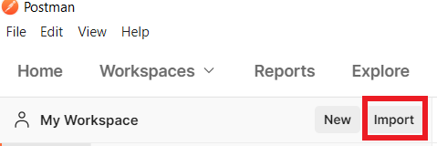
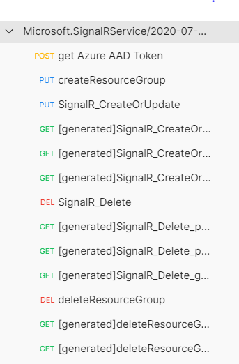

<!--
 Copyright (c) 2021 Microsoft Corporation

 This software is released under the MIT License.
 https://opensource.org/licenses/MIT
-->

# API test quick start

## Install

`oav` is an open source powerful tool for swagger validation, example generation, and api testing. GitHub: https://github.com/Azure/oav.

```sh
npm install -g oav@latest
```

## Create AAD app

To run api test, first please prepare an AAD app which is used for provisioning Azure resource. Please grant subscription contributor permission to this AAD app.

## Authoring step

We will write test scenario for SignalR service.

#### 1. Write your first test scenario file

First, create a folder `test-scenarios` under the api version folder. All test scenario files under the `test-scenarios` folder should bind with the api version.


Now write your basic test scenario. For more detail about test scenario file format, please refer to
[Test Scenario Definition Reference](./TestDefinitionReference.md)

```yaml
scope: ResourceGroup
testScenarios:
  - description: Microsoft.SignalRService/signalR SignalR_CreateOrUpdate
    steps:
      - step: SignalR_CreateOrUpdate
        exampleFile: ../examples/SignalR_CreateOrUpdate.json
      - step: SignalR_Delete
        exampleFile: ../examples/SignalR_Delete.json
```

#### 2. create your env file

The `env.json` file contains required test scenario variables such as, subscriptionId, AAD applicationId, AAD applicationSecret.

```json
{
  "subscriptionId": "<my subscription id>",
  "location": "westus",
  "tenantId": "AAD app tenantId",
  "client_id": "my add client_id",
  "client_secret": "<my aad client_secret>"
}
```

#### 3. Run api test

```sh
oav run-test-scenario /home/user/<xxx>/azure-rest-api-specs/specification/signalr/resource-manager/Microsoft.SignalRService/preview/2020-07-01-preview/test-scenarios/signalR.yaml -e env.json
```

#### 4. Debug with postman

Sometimes the command `oav run-test-scenario` failed due to non 2xx status. Now you need to debug the test scenario with postman.

When run `run-test-scenario`, it automatically generate postman collection and postman env in `generated/<providerNamespace>/<testScenarioFile>/<runId>/<testScenario>`. Here is the generated file folder structure.

```
generated
└── Microsoft.SignalRService
    └── 2020-07-01-preview
        └── signalR
            └── 202105120922-5c3x5
                ├── signalR_0
                │   ├── collection.json
                │   └── env.json
                └── signalR_0.json
```

Postman is a widely used GUI API testing tool. And you could use Postman import the generated postman collection and env for your local debug.



After you import postman collection, you will get such requests. Now you could debug api test happily.



#### 5. manual update example value

After debug with postman, you need to rewrite back the update value and make sure `oav run-test-scenario <test-scenario-file> -e <env.json>` should pass.
